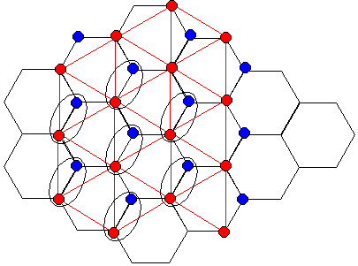

The entities occupying the sites of a lattice are usually not single atoms, but multiatomic molecules, and the arrangement of these atoms at each site is referred to as the *basis*.  The term *crystal structure* generally implies a lattice and a basis. A lattice with a basis can also be used to generate regular arrays of points that are not lattices. The honeycomb structure is not a lattice, but can be formed using a hexagonal lattices with a two-point basis, as shown here

The red (or blue) sites by themselves are arranged onto a hexagonal lattice (highlighted by the red lines). The basis is formed by a red and blue atom taken together (as indicated by the ovals), and when arranged as shown, they give rise to the honeycomb structure (highlighted by the black lines).

Important examples of 3-dimensional structures constructed as a lattice and a basis include the diamond structure and the hexagonal closed-packed (*hcp*) structure. Sometimes true&nbsp;Bravais lattices are constructed not with their natural primitive vectors and a monatomic basis, but with a different set of vectors (usually cubic) and a multiatomic basis. The *fcc* and *bcc* structures are often viewed this way, using a cubic lattice and a 4-site or 2-site basis, respectively. The practice is common enough that the conventional definition of the planes in terms of Miller indices for these lattices is based on a cubic rather than the fundamenal *fcc* or *bcc* primitives.

Compounds, which are solid mixtures having particular ratios of the species, form structures that are described using a lattice with a basis.  Examples include the NaCl, CsCl, and ZnS (zincblende) structures.