=Atomistic Simulation=

Launch the **Droplet (Atomic)** applet. Leave the squeezing force at its default value (4.0) and rotate the view slightly. 

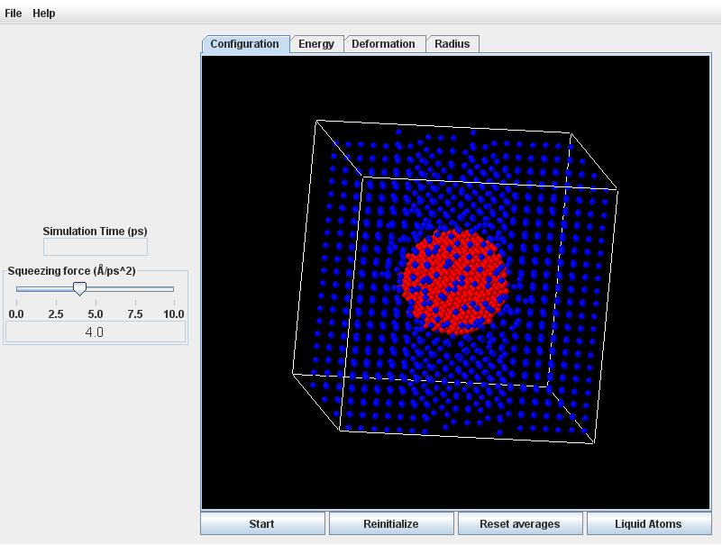

Click the **Start** button. Quite quickly the initially ordered lattice of atoms will randomize with thermal motion. During this initial readjustment, the atoms in the drop will crowd closer together (according to the liquid density in equilibrium with the vapor at 118K).

Click on the **Radius** tab to observe the radius will decreasing commensurately. 

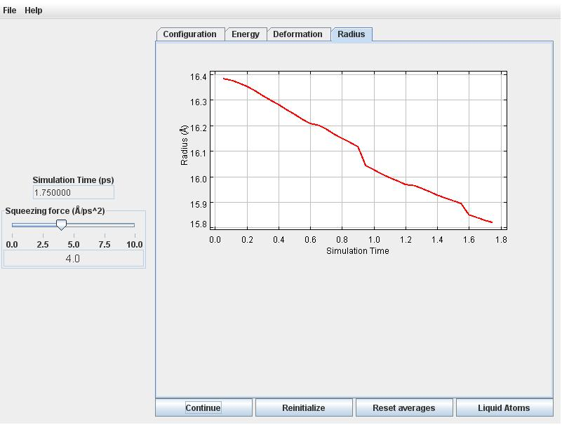

Now click on the **Deformation** tab. You will notice the deformation to become increasingly negative following some initial fluctuations. Eventually (after about 100 picoseconds) the deformation and energy will begin to level off. 

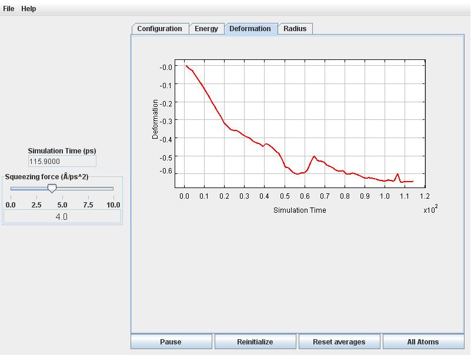

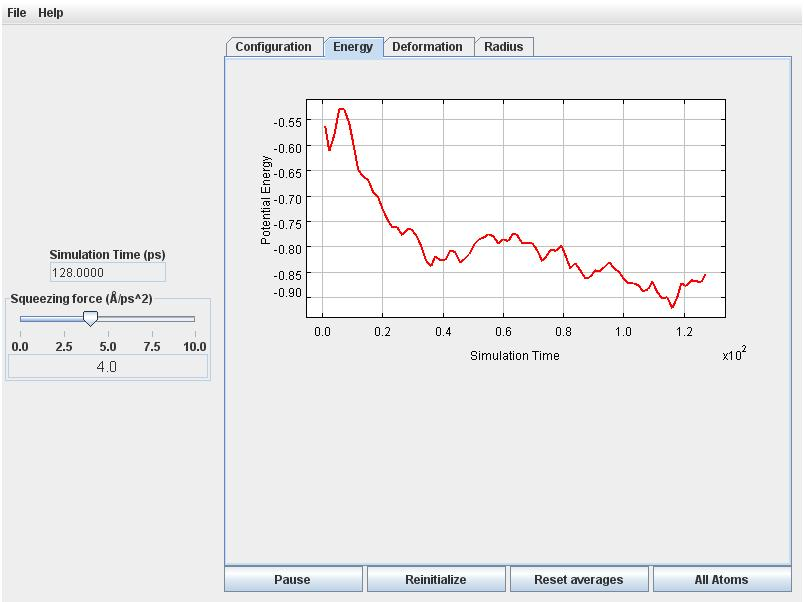

Retirn to the **Radius** tab. The radius fluctuates around 16 Angstroms.

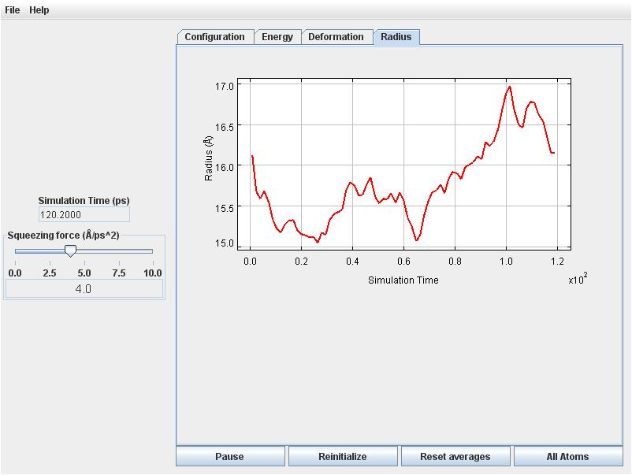

Finally, return to the **Configuration** tab, and view the droplet from a few different angles with the vapor atoms removed. You should see that the droplet has flattened into a disc-like (oblate) shape. 

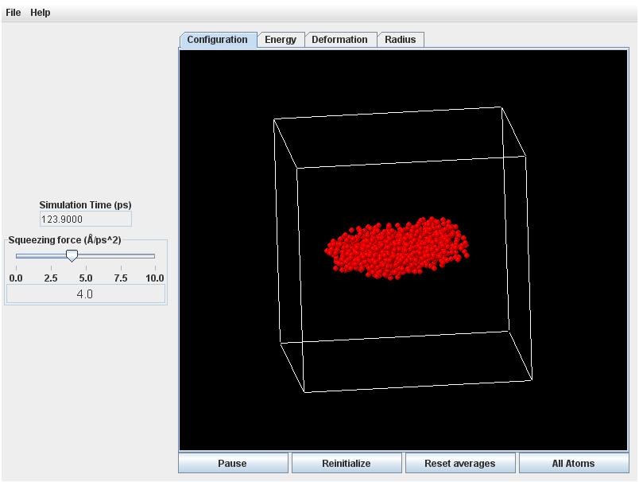

=Continuum Simulation=

Launch the **Droplet** applet. Leave the default time step (0.2) and then rotate the display.

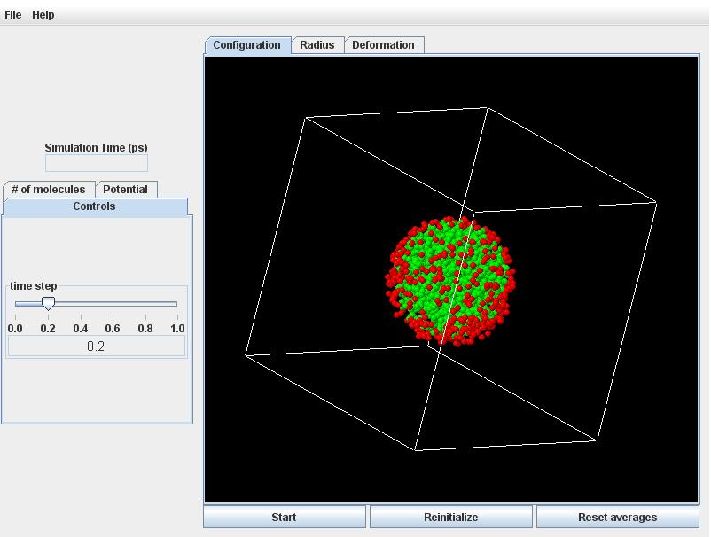

Click the **# of molecules** tab, and set the **initial deformation** slider to -0.5 and +0.5 for an oblate versus prolate droplet.

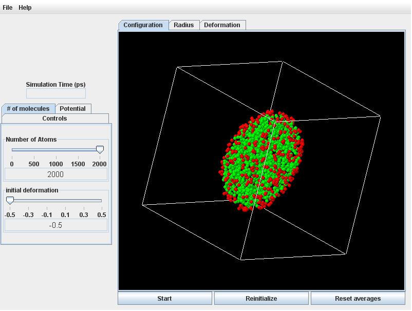

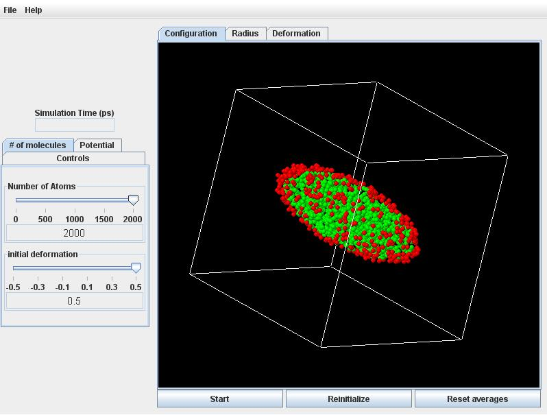

Now adjust the **Number of Atoms** slider to 1000, and observe that the discretization becomes coarser (fewer and bigger particles). The computation time scales roughly with the square of the number of particles.

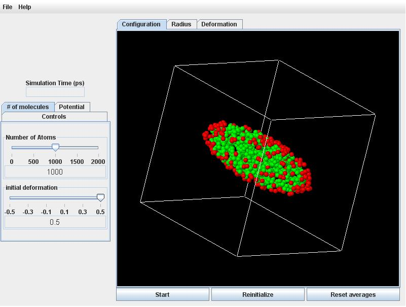

Click on the **Potential** tab, and adjust the **Squeezing Force** slider to 0.0. But leave the **Cohesion Strength** slider at its default value of 1.0.

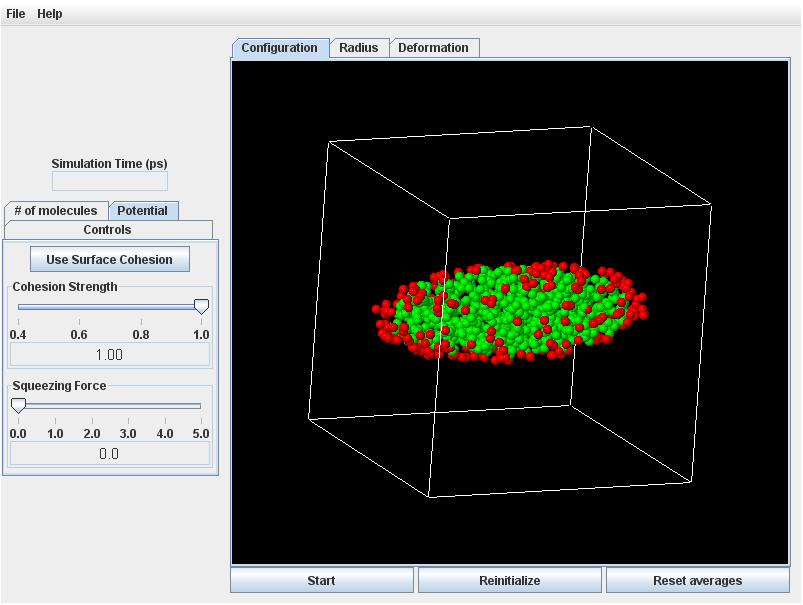

Click the **Start** button on the button of the view panel. The drop will immediately start to snap back toward the spherical shape. Click the **Deformation** tab to confirm that that the deformation is decreasing. 

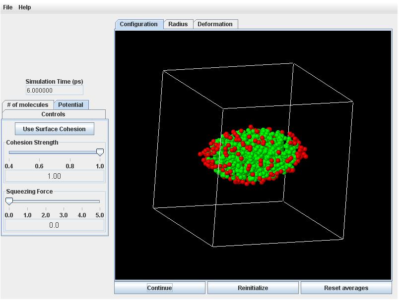

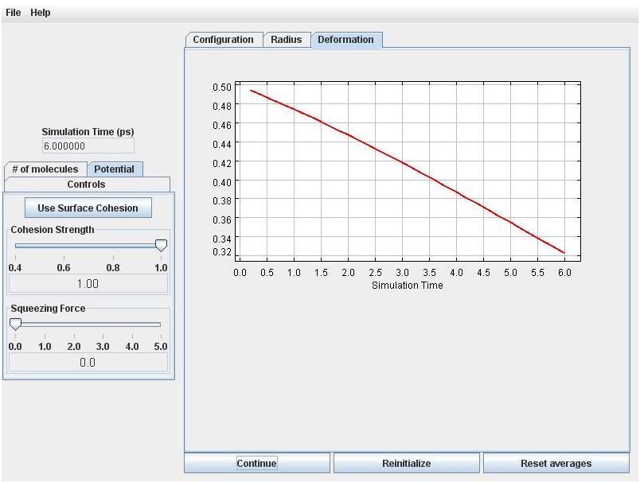

Click the **Radius** tab. You will see that the effective radius is decreasing, which means that volume is not quite perfectly conserved by the numerical simulation scheme. But the error is small (initially less than 1%). With more particles the volume error will be smaller.

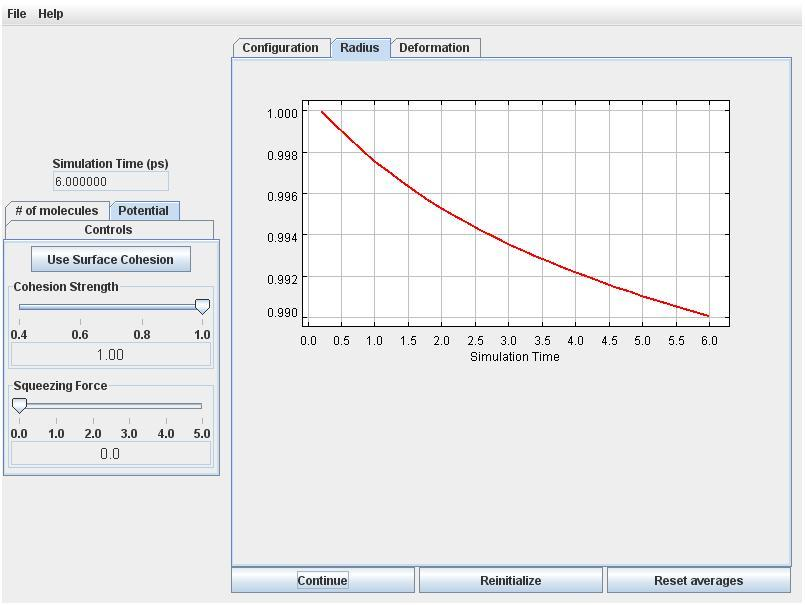