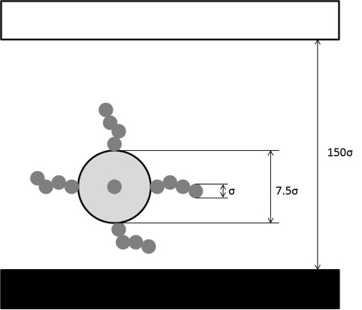

## Simulation Box Details 

The module has been developed so that one colloidal brush is simulated within a region confined by two parallel solid surfaces. Thus the simulation box is orthorhombic, as schematically represented below. Periodic boundary conditions are applied in the directions parallel to the solid surfaces (X and Y). No periodic boundary condition is applied along the Z direction, perpendicular to the solid substrate.

The simulated system is represented below. It should be pointed out that the diameter of one polymer segment (also called monomer), σ, is the unit length used throughout the module.

 
In the schematic above, the black surface, located at the bottom of the simulation box attracts the colloidal brush. The white surface is treated as a hard wall, and therefore repels both colloid and polymer segments.

## Colloidal Brush 

The diameter of one polymer segment, σ, is the unit length within this module. The colloid diameter is treated as parameter within the module. The colloid diameter should be larger than the diameter of one polymer segment, σ, to obtain meaningful results. It is suggested to set the colloid diameter to 7.5 times σ. If larger colloids are preferred, no problem is expected. If the colloid diameter reduces to ~σ then a star polymer will be simulated rather than a colloidal brush.

Several polymer chains (0-12) are grafted onto the colloid. The grafting points are rigidly connected to the colloid and equally spaced on the colloid surface. The number of polymer chains grafted to the colloid is treated as a parameter within this module. To attain meaningful results within a reasonable amount of computing time it is suggested to use a limited number of grafted chains (i.e., 6-8). If more chains are desired, the module will perform satisfactorily, but longer simulations are required to reach equilibrium conditions.

The grafted polymer chains are simulated according to the freely-jointed-tangent-sphere formalism. Namely, two consecutive polymer segments in the chain are located at a center-to-center distance of 1σ, which is not allowed to change during the simulations. Neither bond-length, nor bond-angle interaction potential is considered. As a consequence the polymer segments can rotate freely with respect to each other. However, these rotations are restricted because the polymer segments interact with each other, with the colloid, and with the surfaces, as described below.

The length of each grafted polymer chain is treated as a parameter within this module. All grafted chains have the same length, in the range 0 to 50 segments. When the length is 0, the colloidal brush is treated as a spherical colloid. The simulations become more demanding as the length of the grafted chains increases. It is suggested to maintain the chain length below 30, especially when several grafted chains are simulated on the colloid.

## Interaction Potentials 

All simulations are conducted using the [discontinuous molecular dynamics algorithm](DMD). To be consistent, all interactions are described with square-well potentials.

The interactions of interest are: repulsive wall – colloid, repulsive wall – polymer segment; attractive wall – colloid, attractive wall – polymer segment, polymer segment – polymer segment, and colloid – polymer segment.

The repulsive wall is treated as a hard wall. Consequently both repulsive wall – colloid and repulsive wall – polymer segment are treated as hard-sphere potentials (the potential equals infinity when the repulsive wall overlaps either the colloid or one polymer segment, and zero otherwise).

The attractive wall interacts with a square-well type potential with both colloid and polymer segments. The width of these two potentials is fixed. This parameter is set to 2 for the attractive wall – polymer segment potential, and to 10 for the attractive wall – colloid potential.
The depth of the attractive wall – colloid potential can be changed as parameter in this module (wall epsilon). The built-in value is 0.5 kBT. The depth of the attractive wall – polymer segment (monomer) interaction potential depends on the polymer segment – polymer segment potential. Namely, the stronger the attraction between two polymer segments is, the stronger the attraction between one polymer segment and the attractive wall is as well. The depth is obtained as  &epsilon;SurfMon = (&epsilon;MonMon&epsilon;SurfSurf)1/2. The built-in value for &epsilon;SurfSurf is 0.25 kBT.

The polymer segments interact via square well potentials with other polymer segments. The widths of these interactions are fixed in this module, but their depths are a parameter that the user can change. The user can directly change the depth of the polymer segment – polymer segment interaction potential (εMonMon).
The polymer segments interact via a hard-sphere-type potential with the colloid.

As the input parameter εMonMon changes, the solvent conditions for the grafted polymer chains also change. The deeper the square well is, the stronger the attraction is between two polymer segments. Thus, as the square well from shallow becomes deep the solvent conditions become from ‘good’ to ‘poor’. At good solvent conditions each polymer chain is expanded in its coil form. Under poor solvent conditions the polymer chains collapses into a globule.